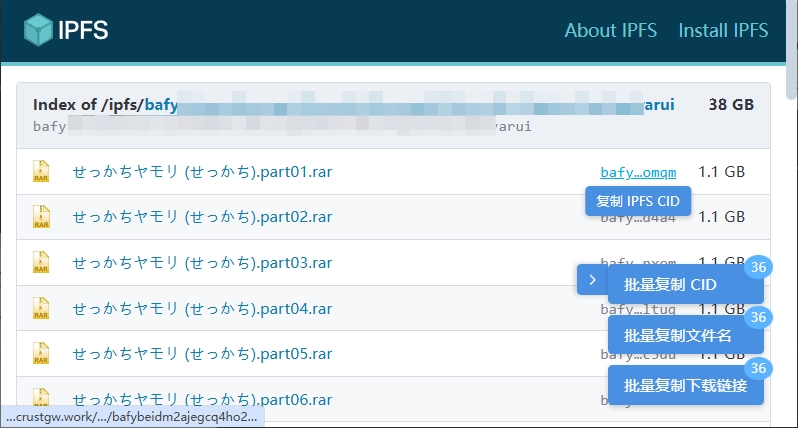

# IPFS CID Copy Helper

一个功能强大的Tampermonkey脚本，用于自动识别网页中的IPFS链接和CID，提供一键复制、网关测速和批量操作功能，让您的IPFS体验更加便捷高效。

  

## ✨ 功能特点

- **自动识别IPFS内容**：自动检测网页中的IPFS CID (v0/v1)和IPNS Key，无论是链接还是纯文本
- **一键复制功能**：鼠标悬停在IPFS内容上即可显示复制按钮，一键获取CID或下载链接
- **网关测速工具**：内置IPFS网关测速功能，帮您找到最快的网关，提升下载和访问体验
- **批量操作支持**：可以批量复制页面上的所有CID、文件名或下载链接
- **完全可自定义**：支持自定义默认网关、排除特定网站、管理网关列表等
- **兼容各类网站**：适用于任何网站，智能识别各种格式的IPFS内容

## 📥 安装指南

### 前提条件

1. 安装 [Tampermonkey](https://www.tampermonkey.net/) 浏览器扩展
   - [Chrome 版本](https://chrome.google.com/webstore/detail/tampermonkey/dhdgffkkebhmkfjojejmpbldmpobfkfo)
   - [Firefox 版本](https://addons.mozilla.org/en-US/firefox/addon/tampermonkey/)
   - [Edge 版本](https://microsoftedge.microsoft.com/addons/detail/tampermonkey/iikmkjmpaadaobahmlepeloendndfphd)
   - [Safari 版本](https://apps.apple.com/app/tampermonkey/id1482490089)

### 安装脚本

**方法一：一键安装**

直接点击以下链接安装：
[安装脚本](https://github.com/cenglin123/ipfs-cid-copy-helper/raw/main/ipfs-cid-copy.user.js)

**方法二：手动安装**

1. 访问 [GitHub 仓库](https://github.com/cenglin123/ipfs-cid-copy-helper)
2. 查看 `ipfs-cid-copy.user.js` 文件内容
3. 复制代码
4. 打开 Tampermonkey 的管理面板
5. 点击"添加新脚本"
6. 粘贴代码并保存

## 🛠️ 使用方法

### 基本用法

[测试 IPFS 链接](https://ipfs.io/ipfs/bafybeihzpvolsy7kt2ug37nwau2d4a5cfcl3bvafsssphpdw7voi5rjadm?filename=wukong.png)

[测试 IPNS 链接](https://ipfs.io/ipns/k51qzi5uqu5dh1ts2qvcw3069src00zyjw0qmwdkb102k8q4ft8bztw75iwi25)

1. **复制单个CID或链接**：
   - 将鼠标悬停在任何IPFS CID或链接上
   - 点击出现的"复制CID"或"复制下载链接"按钮
   - 内容将自动复制到剪贴板

2. **网关测速**：
   - 将鼠标悬停在任何IPFS CID或链接上
   - 点击出现的"网关测速"按钮
   - 在测速窗口中点击"开始测速"
   - 测试完成后选择最快的网关

3. **批量操作**：
   - 页面右下角会显示批量操作按钮
   - 点击"批量复制CID"一次性复制所有检测到的CID
   - 点击"批量复制文件名"复制所有文件名
   - 点击"批量复制下载链接"获取所有下载链接

### 高级功能

1. **管理排除网址**：
   - 通过Tampermonkey菜单中的"管理排除网址"选项
   - 可以添加不希望脚本运行的网站
   - 支持完整网址、通配符匹配和关键词匹配

2. **自定义默认网关**：
   - 通过Tampermonkey菜单中的"设置纯文本CID复制下载链接的默认IPFS网关"选项
   - 可以设置自己偏好的IPFS网关

3. **管理网关列表**：
   - 在网关测速窗口中点击"管理网关"
   - 可以添加、删除或修改测速使用的网关列表
   - 支持一键重置为默认网关列表

## ⚙️ 配置选项

脚本提供了多种配置选项，可通过Tampermonkey菜单访问：

| 配置项 | 描述 |
|--------|------|
| 切换右下角浮窗默认展开/收起状态 | 设置批量操作按钮的默认显示状态 |
| 管理排除网址 | 配置不希望脚本运行的网站 |
| 设置纯文本CID复制下载链接的默认IPFS网关 | 自定义复制CID链接时使用的默认网关 |
| 打开IPFS-SCAN | 快速访问IPFS-SCAN服务 |
| 打开IPFS网关测速器 | 直接打开内置的网关测速工具 |

## 📸 效果展示

### 悬停复制按钮
当鼠标移动到IPFS链接或CID文本上时，会显示复制按钮和网关测速按钮。

### 批量操作按钮
页面右下角会显示批量操作按钮，可以一键复制当前页面上的所有IPFS内容。

### 网关测速工具
网关测速工具会测试多个IPFS网关的响应速度，帮助您找到最快的网关。

## 🌐 默认支持的网关

脚本内置了30多个常用IPFS网关，包括：
- https://ipfs.io
- https://dweb.link
- https://w3s.link
- https://nftstorage.link
- https://ipfs.runfission.com
- 等等...

您可以在网关管理界面添加或删除网关。

## 🔄 更新日志

### 版本 3.0
- 新增网关测速功能
- 新增网关管理功能
- 提升CID识别准确性
- 优化用户界面和交互体验
- 改进批量复制功能

### 版本 2.0 (之前版本)
- 添加批量复制功能
- 添加文件名提取功能
- 支持排除特定网站

### 版本 1.0 (初始版本)
- 基本CID识别和复制功能
- 支持IPFS CID v0/v1和IPNS Key

## 🤝 贡献指南

欢迎为本项目做出贡献！以下是参与方式：

1. Fork 本仓库
2. 创建您的特性分支 (`git checkout -b feature/AmazingFeature`)
3. 提交您的更改 (`git commit -m 'Add some AmazingFeature'`)
4. 推送到分支 (`git push origin feature/AmazingFeature`)
5. 打开一个 Pull Request

## 📝 问题反馈

如果您遇到任何问题或有改进建议，请：

1. 查看 [已知问题](https://github.com/cenglin123/ipfs-cid-copy-helper/issues) 列表
2. 如果没有找到相关问题，[创建新 Issue](https://github.com/cenglin123/ipfs-cid-copy-helper/issues/new)

## 📜 许可证

本项目采用 MIT 许可证 - 详情请参阅 [LICENSE](LICENSE) 文件

## 🙏 鸣谢

- 感谢所有IPFS网关服务提供商
- 感谢所有使用并提供反馈的用户
- 特别感谢IPFS社区和生态系统的所有贡献者

---

如果您觉得这个脚本有用，请给项目一个 ⭐️！
